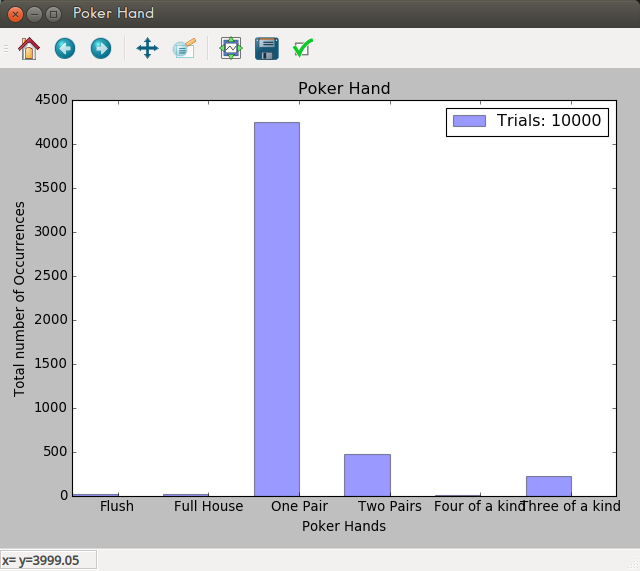

# PokerHand

A Simple python program to calculate probability of PokerHand occurrences. It can print result to the console or plot a graph depending on the user's choice.

> For the graph plotting, you first need to install **matplotlib** module on **Python 2 or 3**.You can easily do that by going to the terminal/shell and typing

```python
$ pip install matplotlib
```

## Categories Supported

* Flush
* Four Of A Kind
* Full House
* One Pair
* Three Of A Kind
* Two Pairs

## Usage

Open `Run.py` to view result.

`Line 9` can be editted to get the preferred result. It defines a probability class instance that takes `1` to `7` arguments

### arguments
* __amount*__ --> The amount of times to run the poker hand generator.
* __choice__ --> Choice is a tuple that takes a minimum of one argument and up to six other arguments.
	* __Choice__ options are:
		* `"f"` or `"flush"` for a **Flush**
		* `"foak"` or `"four of a kind"` for **Four Of A Kind**
		* `"fh"` or `"Full House"` for **Full House**
		* `"op"` or `"One Pair"` for **One Pair**
		* `"toak"` or `"Three of a kind"` for **Three Of A Kind**
		* `"tp"` or `"Two Pairs"` for **Two Pairs**

> **Note**: Argument `1` (amount) is compulsory. You must also specify at least one other value for a list of the optional arguments in choice.
> Choice options are case-insensitive and they also ignore spaces.

## Example


```python
probability = Probability(10000, "f", "fh", "op", "tp", "foak", "toak")
```

To plot a graph, use:

```python
probability.plot()
```

### Screenshot


To print result in console, use:

```python
probability.show()
```

### Result

```python

10000 hands dealt
=================

Flush occurred 22 times
Estimated P(Flush) is: 0.220

Full House occurred 21 times
Estimated P(Full House) is: 0.210

One Pair 4246 times
Estimated P(One Pair) is: 42.460

Two Pairs 516 times
Estimated P(Two Pairs) is: 5.160

Four of a kind 3 times
Estimated P(Four of a kind) is: 0.030

Three of a kind 211 times
Estimated P(Three of a kind) is: 2.110
```

## Contributing

All contributions are welcome. [fork it on Github](https://github.com/tushortz/PokerHand.py) and create a pull request. Any suggestions or bugs, please let me know.

## License

© 2016 Taiwo Kareem | taiwo.kareem36@gmail.com.

Read **license.txt**

## Acknowledgements

I'd first like to say a very big thank you to God my creator. Without him, this wouldn't be possible.